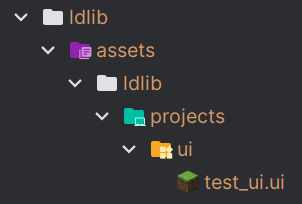
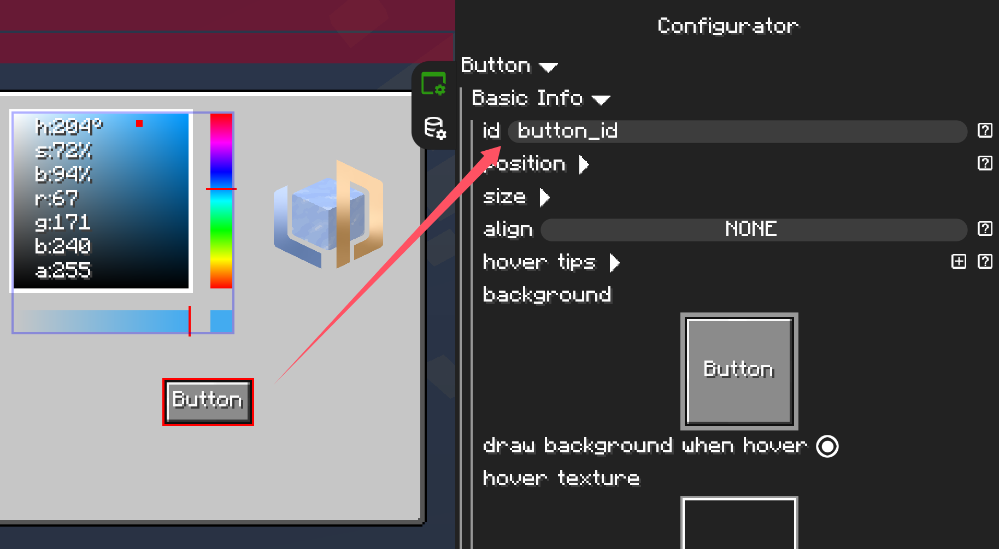

# Load UI from file

Through creating UI by code has more flexibility, using [`UI Editor`](../ui_editor/index.md) instead is more intuitive and easy for novice. The ideal approach is to design the ui layout via the Editor and bind UI functional logic via code.

!!! note "before reading"
    Make sure you has basic knowledge of how to create the ui via [`UI Editor`](../ui_editor/index.md) and prepare a ui file for loading.

Loading ui file is realy easy, just few lines code. We suppose you have a ui file with the location `.minecraft/ldlib/assets/ldlib/projects/ui/test_ui.ui`.

{ width="30%" style="display: block; margin: 0 auto;" }

You can get a `creator` via the method `UIProject.loadUIFromFile(location)`. `creator` caches the resources to speed up the creation process which should be stored for the same project loading.

!!! warning
    `creator` may be null if the ui file counld not be loaded.

=== "Java"

    ``` java 
    public WidgetGroup createUI() {
        var creator = UIProject.loadUIFromFile(new ResourceLocation("ldlib:test_ui"));
        // creator caches the resources to speed up the creation process.
        // you should better store it for the same project loading.
        return creator.get();
    }
    ```

=== "KubeJS"

    ``` javascript
    function createUI() {
        let creator = UIProject.loadUIFromFile("ldlib:test_ui");
        // creator caches the resources to speed up the creation process.
        // you should better store it for the same project loading.
        return creator.get();
    }
    ```

---

## Bind UI functional logic

After loading the ui project, we should bind the functional logic for it. First, we should get the instance of the widget. LDLib provide two methods to obtain it:

1. `List<Widget> getWidgetsById(regex)`: Get all widgets based on a regex pattern and return all of them.
2. `Widget getFirstWidgetById(regex)`: Get all widgets based on a regex pattern and return the first one.

!!! note
    Do not forget to assign an `id` to the widgets you need.
    { width="70%" style="display: block; margin: 0 auto;" }

=== "Java"

    ``` java 
    public WidgetGroup createUI() {
        var creator = UIProject.loadUIFromFile(new ResourceLocation("ldlib:test_ui.ui"));
        // creator caches the resources to speed up the creation process.
        // you should better store it for the same project loading.
        var root = creator.get();

        var button = root.getFirstWidgetById("button_id");
        if (button != null) {
            button.setOnPressCallback(clickData -> {
                System.out.println(clickData.isShiftClick);
            });
        }
        
        return root;
    }
    ```

=== "KubeJS"

    ``` javascript
    function createUI() {
        let creator = UIProject.loadUIFromFile("ldlib:test_ui.ui");
        // creator caches the resources to speed up the creation process.
        // you should better store it for the same project loading.
        let root = creator.get();

        let button = root.getFirstWidgetById("button_id");
        if (button != null) {
            button.setOnPressCallback(clickData => {
                console.log(clickData.isShiftClick);
            });
        }

        return root;
    }
    ```