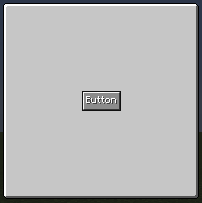

# ButtonWidget

{ width="30%" align=right }

The ButtonWidget is a UI widget representing a clickable button in the GUI system

## Basic properties

All properties can be accessed via Java / KubeJS.


| Field       | Description                          |
| :---------- | :----------------------------------- |
| `isClicked`       | is the button clicked currently |

---

## APIs

### `setButtonTexture()`

Equal to the [`setBackground`](index.md#setbackground).

=== "Java / KubeJS"

    ``` java 
    button.setButtonTexture(ResourceBorderTexture.BUTTON_COMMON, new TextTexture("Button"));
    ```
---

### `setClickedTexture()`

Remove child widget from it.

=== "Java / KubeJS"

    ``` java 
    button.setClickedTexture(ResourceBorderTexture.BUTTON_COMMON, new TextTexture("Clicked"));
    ```
---

### `setOnPressCallback()`

Used to bind functional logic.

`ClickData` provides mouse state information:

1. `clickData.button`: mouse button id number.

    | button       | Description                          |
    | :---------- | :----------------------------------- |
    | `0`       | left button |
    | `1`       | right button |
    | `2`       | middle button |

2. `clickData.isShiftClick`: is the shift key typed.
3. `clickData.isCtrlClick`: is the ctrl key typed.
3. `clickData.isRemote`: is the remote enverionment.

=== "Java"

    ``` java 
    button.setOnPressCallback(clickData -> {
        if (clickData.isRemote) { // can be used to check trigger side
            
        }
    });
    ```

=== "KubeJS"

    ``` javascript 
    button.setOnPressCallback(clickData => {
        if (clickData.isRemote) { // can be used to check trigger side
            
        }
    });
    ```

---
