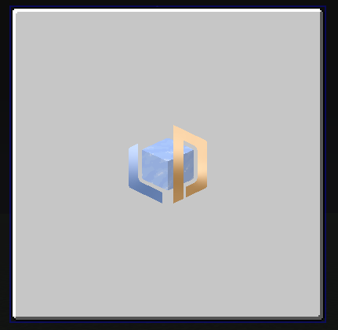

# ImageWidget

{ width="30%" align=right }

`ImageWidget` is used to display images, which provided by a [`GUI Texture`](../textures.md).

## Basic Properties

| Field           | Description                                        |
|-----------------|----------------------------------------------------|
| border          | The border width (range: -100 to 100)              |
| borderColor     | The color of the border                            |

---

## APIs

### setImage

Sets the image texture using a texture instance.

=== "Java / KubeJS"

    ``` java
    imageWidget.setImage(new ResourceTexture("ldlib:textures/gui/icon.png"));
    ```

---

### setImage

Sets the image texture using a supplier.

=== "Java"

    ``` java
    imageWidget.setImage(() -> new ResourceTexture("ldlib:textures/gui/icon.png"));
    ```

=== "KubeJS"

    ``` javascript
    imageWidget.setImage(() => new ResourceTexture("ldlib:textures/gui/icon.png"));
    ```

---

### getImage

Returns the current image texture.

=== "Java / KubeJS"

    ``` java
    var texture = imageWidget.getImage();
    ```

---

### setBorder

{ width="20%" align=right }

Sets the border width and color.

=== "Java / KubeJS"

    ``` java
    imageWidget.setBorder(2, 0xFFFFFFFF); // ARGB
    ```

---