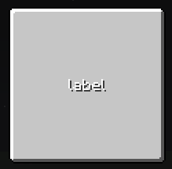

# LabelWidget

{ width="30%" align=right }

`LabelWidget` is used to display text and component.

!!! note "Advanced Widget"
    `LabelWidget` is a light-weight widget to display text only. text height, align, ... are fixed.
    Therefore, we reconmend to use the [`TextTextureWidget`](TextTexture.md) instead, which provids advanced controll of text display.


## Basic Properties

| Field           | Description                                                                       |
|-----------------|-----------------------------------------------------------------------------------|
| `color`         | The text color as an integer                                                      |
| `dropShadow`    | Indicates whether the drop shadow effect is enabled                               |
| `lastTextValue` | currently text `read only` |

---

## APIs

### `setText()`

Updates the label text with a `string`.

=== "Java / KubeJS"

    ``` java
    label.setText("New Label Text");
    ```

---

### `setComponent()`

Same as `setText()` but support `component` as input

---

### `setTextProvider()`

Configures a supplier to dynamically provide the label text. It will obtain the latest text per tick.

=== "Java"

    ``` java
    label.setTextProvider(() -> "Dynamic Text");
    ```

=== "KubeJS"

    ``` javascript
    label.setTextProvider(() => "Dynamic Text");
    ```

---

### `setColor()`

Sets the text color. If a rich text component is already set, its style will be replaced accordingly.

=== "Java / KubeJS"

    ``` java
    label.setColor(0xFFFFFFFF); // ARGB
    ```

---

### `setDropShadow()`

Enables or disables the drop shadow effect for the label.

=== "Java / KubeJS"

    ``` java
    label.setDropShadow(true);
    ```

---