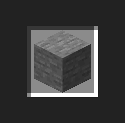

# SlotWidget

{ width="30%" align=right }


The `SlotWidget` represents an interactive item slot within a container GUI. This widget supports configurable properties such as whether items can be taken or placed, customizable hover overlays and tooltips, and integration with JEI/REI/EMI systems for displaying ingredient details. It can be configured to represent a slot in either a standard inventory container or via an item transfer handler.

!!! note
    You cannot modify slot widget size.
    

## Basic Properties

| Field             | Description                                                                                 |
|-------------------|---------------------------------------------------------------------------------------------|
| canTakeItems      | Indicates if items can be extracted from the slot (modifiable via setter)                   |
| canPutItems       | Indicates if items can be inserted into the slot (modifiable via setter)                    |
| drawHoverOverlay  | Determines whether a hover overlay is drawn when the mouse is over the slot                 |
| drawHoverTips     | Determines whether tooltips are shown when the mouse hovers over the slot                   |
| lastItem      | Item stored in the last tick.     |

---

## APIs

### setContainerSlot

Associates the widget with an inventory container by specifying the slot index. e.g. player inventory.

=== "Java / KubeJS"

    ``` java
    var player = ...;
    slotWidget.setContainerSlot(player.getInventory(), 2); // bind the player inventory of 2 index.
    ```

---

### setHandlerSlot

Configures the widget to use an item transfer handler with the specified slot index. 

#### Java

!!! note "For Java User !!!"
    If you want to use the handler of `ItemStackHandler`(from forge) or `Storage<ItemVariant>`(from fabric), you need one more line. Because Forge and Fabric has different APIs, you need to convert the handler into the LDLib one, which can be found in `ItemTransferHelperImpl`.

    === "Forge"

        ``` java
        var itemHandler = ...;
        var itemTransfer = ItemTransferHelperImpl.toItemTransfer(itemHandler);
        ```

    === "Fabric"

        ``` java
        var storage = ...;
        var itemTransfer = ItemTransferHelperImpl.toItemTransfer(storage);
        ```

#### KubeJS

KubeJS user do not need to do such mess. We have already convert them into a item transfer internal already.

=== "KubeJS"

    ``` javascript
    slotWidget.setHandlerSlot(itemTransfer, 0);
    ```

---

### setItem

Set the internal itemstack with/without notify.

=== "Java / KubeJS"

    ``` java
    slotWidget.setItem(itemstack); // it will also trigger the listen you set
    slotWidget.setItem(itemstack, false); // it wont trigger the listen
    ```

---

### getItem

Get the internal itemstack stored.

=== "Java / KubeJS"

    ``` java
    var itemstack = slotWidget.getItem();
    ```
---

### setChangeListener

Configures additional slot location information, such as whether it belongs to the player container or hotbar. It will affect the shift move behaviour.

=== "Java"

    ``` java
    slotWidget.setChangeListener(() -> {
        var last = slotWidget.getLastItem();
        var current = slotWidget.getItem();
    });
    ```

=== "KubeJS"

    ``` javascript
    slotWidget.setChangeListener(() => {
        let last = slotWidget.getLastItem();
        let current = slotWidget.getItem();
    });
    ```

---

### canPutStack

Whether can put stack into the slot.

=== "Java / KubeJS"

    ``` java
    slotWidget.canPutStack(true);
    ```

---

### canTakeStack

Whether can take stack from the slot.

=== "Java / KubeJS"

    ``` java
    slotWidget.canTakeStack(true);
    ```

---

### setLocationInfo

Configures additional slot location information, such as whether it belongs to the player container or hotbar. It will affect the shift move behaviour.

=== "Java / KubeJS"

    ``` java
    slotWidget.setLocationInfo(true, false); // (isPlayerContainer isPlayerHotBar)
    ```

---