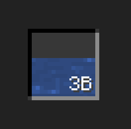

# TankWidget

{ width="30%" align=right }

The `TankWidget` represents a fluid slot widget within a container GUI. It displays a fluid in a designated tank and supports fluid interactions such as filling and emptying. In addition, it integrates with external systems (JEI/REI/EMI) to show fluid ingredient details and provides configurable options for hover overlays, tooltips, and click behavior.

## Basic Properties

| Field              | Description                                                                                  |
|--------------------|----------------------------------------------------------------------------------------------|
| fluidTank          | The fluid storage or transfer handler associated with this widget                            |
| tank               | The index of the fluid tank being represented                                                |
| showAmount         | Determines whether the fluid amount is displayed                                             |
| allowClickFilled   | Controls whether clicking the slot when filled triggers container-filling behavior           |
| allowClickDrained  | Controls whether clicking the slot when empty triggers container-emptying behavior           |
| drawHoverOverlay   | Indicates if a hover overlay should be drawn when the mouse is over the widget                 |
| drawHoverTips      | Indicates if hover tooltips should be displayed                                              |
| fillDirection      | The direction in which the fluid fill is rendered (e.g. DOWN_TO_UP)                           |
| lastFluidInTank      | Last fluid stored in the tank                           |
| lastTankCapacity      | Last tank capacity                          |


---

## APIs

### setFluidTank (IFluidStorage)

Associates the widget with a fluid storage and sets the tank index to 0.

=== "Java / KubeJS"

    ``` java
    tankWidget.setFluidTank(fluidStorage);
    ```

---

### setFluidTank (IFluidTransfer, int)

Associates the widget with a fluid transfer handler and specifies the tank index.

=== "Java / KubeJS"

    ``` java
    tankWidget.setFluidTank(fluidTransfer, 1);
    ```

---

### setFluid

Set the internal fluidstack with/without notify.

=== "Java / KubeJS"

    ``` java
    tankWidget.setFluid(fluidstack); // it will also trigger the listen you set
    tankWidget.setFluid(fluidstack, false); // it wont trigger the listen
    ```

---

### getFluid

Get the internal fluidstack stored.

=== "Java / KubeJS"

    ``` java
    var fluidstack = tankWidget.getFluid();
    ```
---

### setChangeListener

Configures additional slot location information, such as whether it belongs to the player container or hotbar. It will affect the shift move behaviour.

=== "Java"

    ``` java
    tankWidget.setChangeListener(() -> {
        var last = tankWidget.getLastFluidInTank();
        var current = tankWidget.getFluid();
    });
    ```

=== "KubeJS"

    ``` javascript
    slotWidget.setChangeListener(() => {
        let last = tankWidget.getLastFluidInTank();
        let current = tankWidget.getFluid();
    });
    ```

---