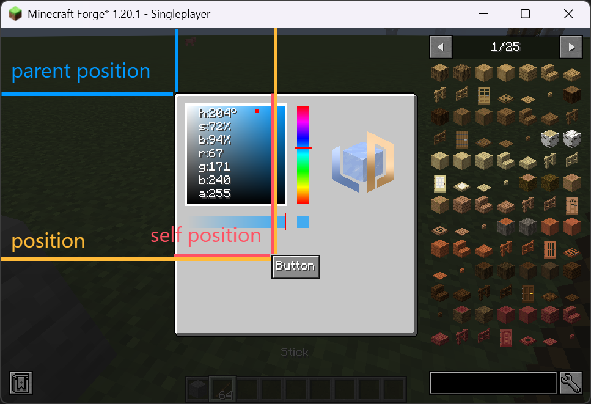

# Preliminary

LDLib provides a wide range of widgets. You can review their functionalities and APIs on their respective pages. In this section, we introduce the fundamental concepts that underlie all widgets, ensuring you have a solid understanding of their common principles.

All widgets inherit from the [Widget](https://github.com/Low-Drag-MC/LDLib-MultiLoader/blob/1.20.1/common/src/main/java/com/lowdragmc/lowdraglib/gui/widget/Widget.java) class. As a result, they all share a set of universal APIs.

---

## Basic properties

All properties can be accessed via Java / KubeJS.

=== "Java"

    ``` java 
    var id = widget.getId();
    var pos = widget.getPosition();
    widget.setSize(10, 32);
    widget.setSlefPosition(10, 10);
    ```

=== "KubeJS"

    ``` javascript
    let id = widget.getId();
    let pos = widget.position // getPosition() is also fine.
    widget.setSize(10, 32);
    widget.setSlefPosition(10, 10);
    ```

| Field       | Description                          |
| :---------- | :----------------------------------- |
| `id`       | Widget id, it doesn't have to be unique，and can be empty.  |
| `selftPosition`       | Self position represents the relative local position in the parent widget |
| `parentPosition`       | Parent widget's global position. |
| `position`       | Global position in the window, which is computed by the self position and parent position. |
| `size`    | Widget size, this property affect the rect collid dection, e.g. hover, click, etc. |
| `isVisible`    | Whether the widget is visible, only affect rendering, logic is still working. |
| `isActive`    | Whether the widget logic is working. |
| `align`    | align position refer to the parent. |
| `backgroundTexture`    | background texture. |
| `hoverTexture`    | darw texture while mouse hover. |
| `overlay`    | overlay texture above the background texture. |
| `parent`    | parent widget. |
| `align`    | align position refer to the parent. |

!!! info "about position"
    `Position` is an important concept. Check the image below:
    { width="70%" style="display: block; margin: 0 auto;" }

---

## APIs

### `setHoverTooltips()`

Used to define the tooltips while the mouse hovered. It support both `string` and `component` as input.

<div>
  <video width="30%" controls>
    <source src="../assets/tooltips.mp4" type="video/mp4">
    Your browser does not support video.
  </video>
</div>

=== "Java / KubeJS"

    ``` java 
    widget.setHoverTooltips("this is a button");
    // widget.setHoverTooltips("line 1", "line2");
    ```

---

!!! info inline end Textures

    LDLib provides massive different types of textures, choose what you want:). See [`GUI Textures`](../textures.md) to check supported textures.

### `setBackground()`

Used to set the background texture of the widget. 

### `setHoverTexture()`

Used to set the hover texture of the widget.


=== "Java / KubeJS"

    ``` java 
    widget.setBackground(new ResourceTexture("ldlib:textures/gui/icon.png"));
    ```

---

### `isMouseOverElement()`

TO check whether the mouse over the widget.

=== "Java / KubeJS"

    ``` java 
    widget.isMouseOverElement(mouseX, mouseY);
    ```

